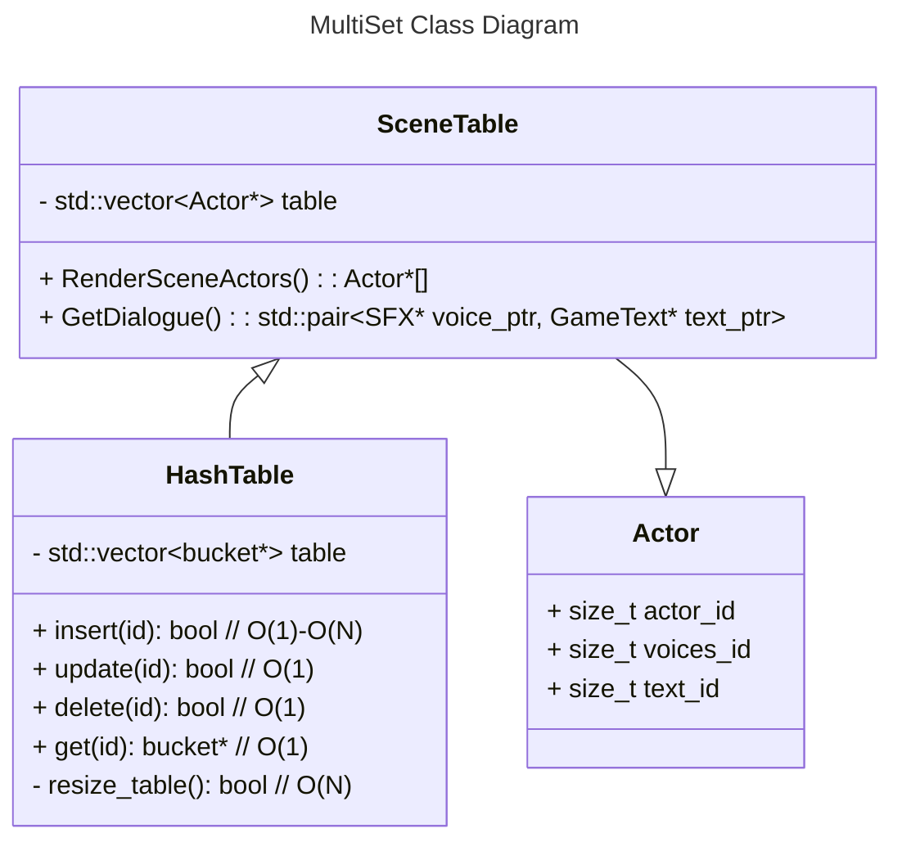
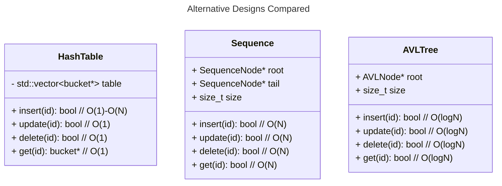

### 1.A - Introduction

My design will model the scene dataset for a given loading zone. The datastructure will be based off of `HashTable<>`

### 1.B - Background
For some background, I am in the process of a Ghidra reverse engineering project for `Ys VI: The Ark of Napishtim` on Windows, and I got the idea from my work on that game. YS VI uses a system where game actors (characters, the player, enemies, etc.) have unique IDs that are used to fetch their dialogue, sprites, and other metadata. However, outside of the PS2 remake, the game lacks voice acting. As such, I have been trying to mod in voice acting to existing dialogue functions. In the original system, a pointer to the dialogue is found using the actor's ID and a scene identifier, and the lines are fed to the display in a single delimited string.

### 1.C - Review of Terms
- Scene
    
    Each level in Ys Vi is split into loading zones or **"scenes"** that have a unique ID (i.e. `s_5502`) that helps the game find the data for the scene (models, actors, etc.).


- Actor

    The term the game uses for its characters, whether the player, NPCs, or enemies. They have associated string IDs just like the scenes.

    ---

    - Player (Adol)

    

    - Moves around and talks (best of both worlds)

    ---

    - Enemy

    
    
    - Moves around but doesn't talk

    ---

    - NPC

    

    - Talks but doesn't move around

### 1.D - Design goal

The

### 2 - Design Philosophy

The design of a system like this should be as simple and as lightweight as possible, but something that is flexible for the needs of a given game scene. The hashtable will take in a raw dataset from the game data when a scene is loaded in. This process should be streamlined for fast load times even in large or busy scenes with lots of actors.

### 3 - Core Operations

> As a hashtable derivative you definitely want your basic CRUD actions
- + insert(id): bool // O(1)-O(N)
> At the intialization of a scene, all the necessary actors are inserted.
- + update(id): bool // O(1)-O(N)
- + delete(id): bool // O(1)-O(N)
- + get(id): bucket* // O(1)
> The scene should be able to fetch the pointers to the actor's data 
- - resize_table(): bool // O(N)
> As with other hashtables, the table size increases capacity when enough are added.

### 4 - Set Operations

- SceneTable(scene_data*): int
> Initialize the table on loading into scene from raw data.
> Returns success value
```C++
int SceneTable::SceneTable(SceneData* scene_data)
{
    scene_data ...;
    //
    // Extract actors from data
    //
    for (Actor* actor in actors)
    {
        // insert into table
        this->insert(actor->actor_id);
    }
    return 0;
}
```
### 5 - Extension Feature

- GetDialogue(actor_id): (audio*, text*)
> Returns pointers to raw audio and text values in the game data that are fed to the game front end functions. The text and audio have delimiters so that the display and audio functions know how many lines are in the dialogue and where the raw data begins and ends.
```C++
std::pair<SFX* voice_ptr, GameText* text_ptr> SceneTable::GetDialogue(size_t actor_id)
{
    try
    {
        Actor* actor = this->get(actor_id);
        std::pair<SFX* voice_ptr, GameText* text_ptr> dialogue_pair(actor->get_voice(this->scene_id), actor->get_dialogue_text(this->scene_id));
        return dialogue_pair;
    }
    catch (...)
    {
        ...
    }
}
```
- RenderSceneActors(): Actor*[]
> For each actor in the scene, load sprites and models from the pointers in the hashtable into memory and display.
> Returns pointers to actors' data in memory
```C++
Actor*[] SceneTable::RenderSceneActors()
{
    for (Actor* actor : this->table)
    {
        GameClass::Render(actor);
    }
    return this->table;
}
```

### 6 - UML Diagram / Abstraction Boundary


> I have used mermaid class diagrams in prior classes, so here's a mermaid diagram for my structures.


### 7.0 - Trade Off Analysis

> Below are some comparisons to other possible data structures:

### 7.1 - `Sequence` Trade Offs
> The main alternative for this multiset's underlying data-structure would be a `Sequence` (std::vector). A `HashTable` is already simply a more complex wrapper for a std::vector, so realistically, a `Sequence` would be more lightweight to implement.

> However, assuming an actor has the same ID across scenes, then when making the vector you wouldn't have a clean `[1,2,3,4,5...]`of ID values (it would be something like `[t_200,t_700,t_567,t_890...]` which is not cleanly searchable). As such, either you would hash the values (which is just a `HashTable` `O(1)` search) or insert them in the order of appearance making the search complexity `O(N)`. As such, given that the IDs are unique, a `HashTable` is simply the better option, especially in large scenes with lots of actors.

### 7.2 - `AVLTree` Trade Offs

> `HashTable` has a worst case insertion complexity of `O(N)` and best case `O(1)` complexity. `AVLTree` consistently has complexity `O(logN)` for its insertion. In this context, where the number of scene actors is not significant, these differences don't matter much. For getting a value though, `HashTable` has a typical complexity of `O(1)` whereas `AVLTree` consistently has a higher `O(logN)` complexity. As such, for a series of values that is primarily only read from, `HashTable` is the better option

### 8 - Alternative Design Sketch



### 9 - Evaluation Plan

Some basic tests to perform would be to compare load times between structures when entering a new scene. If performing `get` actions on the table is slowing down gamespeed a solution with less functionality may need to be explored. How many times the `HashTable` needs to be resized would be the most costly operation performance-wise, so putting breakpoints on that happening is another good way to gauge performance.

### 10 - Conclusion/Reflection

This design for a scene data table works because once it is set up, most actions performed on it have `O(1)` time complexity resulting in low performance overhead. While a `Sequence` or `AVLTree` are more performant to initialize at scale, because the other actions performed on the table significantly exceed that of the initialization, it performs better overall.

The `SceneTable` implementation has a low level of abstractio with the core functions of searching and indexing being made as fast and as simple as possible. It is a simple idea, and a simple execution that results in a low performance overhead. The encapsulation is very good since the load times will be non-substantial, and the end user will not realize the extent of the behind-the-scenes work being done <a href="#2">[1]</a>. Other systems in the game will be able to easily access data for the `actor_id` resulting in a composition where the program does not have to know much of anything about how `SceneTable` even works. New methods can easily be implemented that take advantage of its simple `HashTable` derived CRUD operations.

### Works Cited

<div id="1"></div>

<div id="2">[1] Cahill, Vinny. *Learning to Program the Object-Oriented Way with C#*. pp221-249. https://link.springer.com/chapter/10.1007/978-1-4471-0115-4_7.</div>