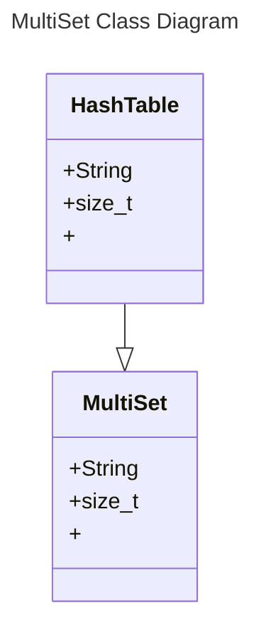

1. Introduction

2. Design Philosophy

3. Core Operations

4. Set Operations

5. Extension Feature

6. UML Diagram / Abstraction Boundary

> I have used mermaid class diagrams in prior classes, so here's a mermaid diagram for my structures.

7. Trade Off Analysis

8. Alternative Design Sketch

9. Evaluation Plan

10. Conclusion/Reflection