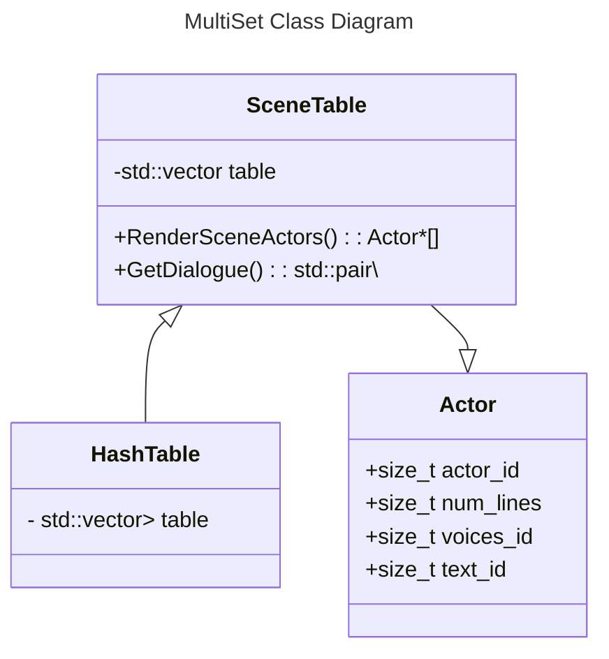

1. Introduction

My design will model the scene dataset for a given loading zone. The datastructure will be based off of `HashTable<>`

For some background, I am in the process of a Ghidra reverse engineering project for `Ys VI: The Ark of Napishtim` on Windows, and I got the idea from my work on that game. YS VI uses a system where game actors (characters, the player, enemies, etc.) have unique IDs that are used to fetch their dialogue, sprites, and other metadata. However, outside of the PS2 remake, the game lacks voice acting. As such, I have been trying to mod in voice acting to existing dialogue functions. In the original system, a pointer to the dialogue is found using the ID, and the lines are fed to the display in a single string seperated by separators.

In a setup with voice acting, where dialogue is given to the player line-by-line, each line has an associated chunk of voice acting. A given actor when loaded into a scene should have an associated actor ID and the game should have a scenario ID which determines what the actor says or doesn't say at that part of the game progression. This hashtable should contain the dataset of actors and their metadata for a given scene ID. When the sprites are loaded into memory, they are pulled from this table at an `actor_id` index. When the player speaks with a friendly actor, the appropriate dialogue text and voice lines should be able to be accessed in the same way.

2. Design Philosophy

The design of a system like this should be as simple and as lightweight as possible, but something that is flexible for the needs of a given game scene. The hashtable will take in a raw dataset from the game data when a scene is loaded in. This process should be streamlined for fast load times even in large or busy scenes with lots of actors.

3. Core Operations


4. Set Operations

- SceneTable(scene_data*): int
> Initialize the table on loading into scene from raw data.
> Returns success value
```C++
int SceneTable::SceneTable(SceneData* scene_data)
{
    scene_data ...;
    //
    // Extract actors from data
    //
    for (Actor* actor in actors)
    {
        // insert into table
        this->insert(actor->actor_id);
    }
    return 0;
}
```
5. Extension Feature

- GetDialogue(actor_id): (audio*, text*)
> Returns pointers to raw audio and text values in the game data that are fed to the game front end functions. The text and audio have delimiters so that the display and audio functions know how many lines are in the dialogue and where the raw data begins and ends.
```C++
std::pair<SFX* voice_ptr, GameText* text_ptr> SceneTable::GetDialogue(size_t actor_id)
{
    try
    {
        Actor* actor = this->get(actor_id);
        std::pair<SFX* voice_ptr, GameText* text_ptr> dialogue_pair(actor->get_voice(this->scene_id), actor->get_dialogue_text(this->scene_id));
        return dialogue_pair;
    }
    catch (...)
    {
        ...
    }
}
```
- RenderSceneActors(): Actor*[]
> For each actor in the scene, load sprites and models from the pointers in the hashtable into memory and display.
> Returns pointers to actors' data in memory
```C++
Actor*[] SceneTable::RenderSceneActors()
{
    for (Actor* actor : this->table)
    {
        GameClass::Render(actor);
    }
    return this->table;
}
```

6. UML Diagram / Abstraction Boundary


> I have used mermaid class diagrams in prior classes, so here's a mermaid diagram for my structures.


7. Trade Off Analysis

> Given that the values for the voices and the dialogue are constant, it could make more sense to simply use an array rather than a hashtable since it would have less overhead. However, with the table you would get more functionality, and I think 

8. Alternative Design Sketch

9. Evaluation Plan

10. Conclusion/Reflection

# MAKE A PDF